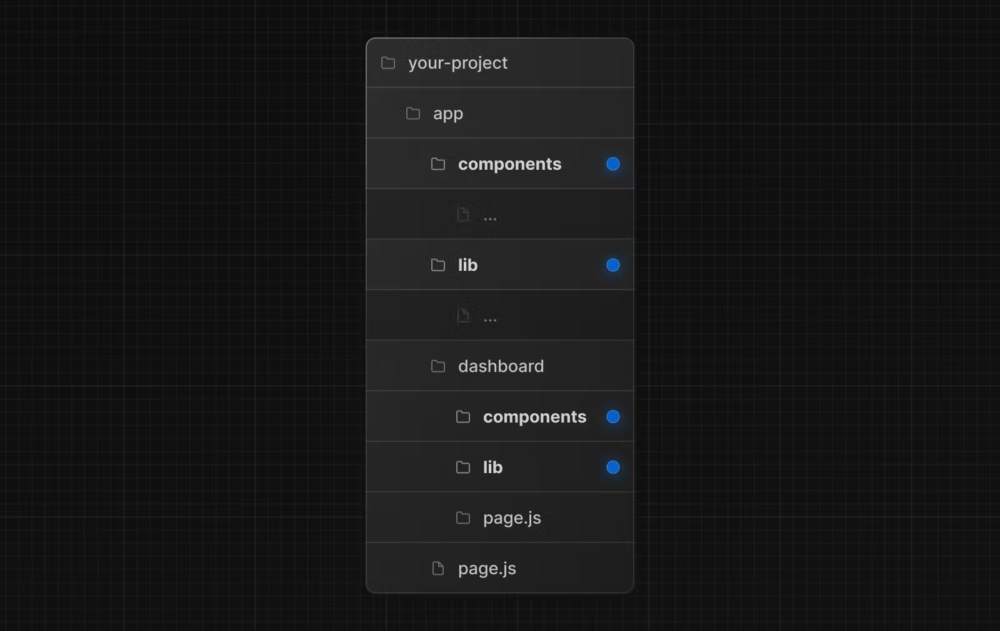

This is a [Next.js](https://nextjs.org/) project bootstrapped with [`create-next-app`](https://github.com/vercel/next.js/tree/canary/packages/create-next-app).

## Getting Started Project Example App

First, run the development server:

```bash
npm run dev
# or
yarn dev
# or
pnpm dev
# or
bun dev
```

Open [http://localhost:3000](http://localhost:3000) with your browser to see the result.

This project uses [`next/font`](https://nextjs.org/docs/basic-features/font-optimization) to automatically optimize and load Inter, a custom Google Font.


## TO DOS
- [ ] check code spliting - lazy loading - dinamic Imports
- [ ] fully Client rendered
- [ ] Node
    - [x] use ```ts-node-> swc:true ``` [more](#nextjs-compiler-swc)
    - [x] use node 20
- [ ] check performance of new Bundler!
- [x] emotion for stylecomponents check ```_components/customMUI```
- [x] styling with Emotion [more info]()

## Nice to have
- [ ] Generate Figma template defining each interface
- [ ] Using Next Api as a middle man for making calls to the api will increase security review [this](https://www.youtube.com/watch?v=vrR4MlB7nBI&t=236s)
- [x] Using Next fotns to improve perfomarnce [info](https://nextjs.org/docs/pages/building-your-application/optimizing/fonts)
- [x] file organization. [suggested file structure](https://nextjs.org/docs/app/building-your-application/routing/colocation#project-organization-strategies)
- [x] using image component


## Things to know
- the components folder has an underscore before its name so the folder is private ['more'](https://nextjs.org/docs/app/building-your-application/routing/colocation)


## Details

### NextJS compiler SWC
Next js already includes SWC by default more customization [here](https://nextjs.org/docs/architecture/nextjs-compiler)

### File Structure


### Styling with Emotion
Emotion can be used but there is not enought documentation with the new NextJS architecture, we can use the old architecture if so info [here](https://reacthustle.com/blog/how-to-setup-mui-with-nextjs-emotion-and-typescript?expand_article=1)

Also Next JS has his own build way to stylize components. info how to use SASS [info](https://nextjs.org/docs/app/building-your-application/styling/sass)

### Using image component
if using images from external server we have to register in the file ```next.config.ts```


### Lazy Loading and Code Spliting
```next/dynamic``` combines lazy and suspense [more]('https://nextjs.org/docs/app/building-your-application/optimizing/lazy-loading')
